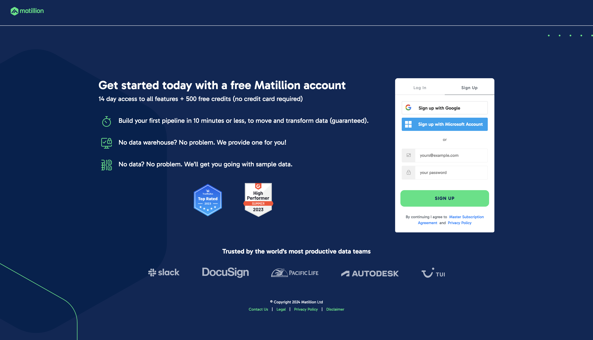

# How to create an account with Matillion

Matillion, the [Data Productivity Cloud](https://www.matillion.com/blog/how-to-build-a-transformation-pipeline-in-the-data-productivity-cloud), is a comprehensive platform designed to enhance data management and productivity for businesses. It provides robust tools for ETL, enabling organizations to efficiently process and analyze their data across various sources. By offering a cloud-native environment, Matillion ensures scalability, flexibility, and performance, allowing companies to seamlessly handle large volumes of data.

Its user-friendly interface and powerful capabilities make it an essential tool for data engineers, analysts, and IT professionals aiming to derive actionable insights and make data-driven decisions.

In this blog, we'll show you how to create an account with Matillion. There's also a [video tutorial](https://matillion.wistia.com/medias/zh57mryjl8) if you prefer.

### Register on the Matillion Hub

To begin, go to [Matillion Hub](https://hub.matillion.com/) and register an account. You'll need to follow the prompts to verify your email address in order to continue your account registration.

### Create Profile

Once you've verified your email, you'll be redirected to a page that looks like the one above. The first thing to do is to create your profile. Use the dropdown input form to select your options and click continue. In the next step, you'll need to enter your name, job title and company name.

> Note that entering your phone number is optional.

Click continue.

### Set Up Account

Now, select the region where you want your matillion account to be created and click continue.

### Select a Data Platform

Finally, you need to select a data platform. For the purposes of this tutorial, we'll be using the
**Matillion trial warehouse** platform as there's no setup required. If it's not already selected then select it and click continue.

> The process of preparing your trial warehouse will take a few minutes, it's important you remain on the page whilst your warehouse completes configuration.

### Registration Complete

Congratulations on completing the registration process of the Matillion Hub. Your 14-day free trial has now started.

> ##### Next Steps
>
> - To further explore Matillion and make the most of your 14-day free trial, you might find the following resources helpful:

[Designer User Interface](https://docs.matillion.com/data-productivity-cloud/designer/docs/designer-ui-basics/) - Get familiar with the Designer User Interface and essential functionalities.

[Designer Overview](https://docs.matillion.com/data-productivity-cloud/designer/docs/designer-overview/) - Understand how to create your own complex ELT pipeline workflows.

[Create a Matillion ETL instance](https://docs.matillion.com/metl/docs/matillion-etl-instance-creation/#max-environments) - Learn how to create a Matillion ETL instance in the Hub.

[Matillion Academy](https://academy.matillion.com/certifications) - Take your data skills to the next level with Matillion Academy. Here, you'll find training videos, how-to guides and everything you need to become a Matillion Subject Matter Expert.
